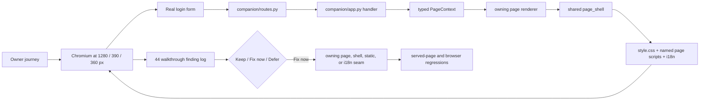

# Phase 44: Companion Walkthrough and Focused Bilingual Polish - Research

**Researched:** 2026-09-30  
**Domain:** Server-rendered bilingual companion UX, responsive behaviour, and accessible interactions  
**Confidence:** HIGH for repository integration and test harnesses; MEDIUM for the cited accessibility guidance

## User Constraints (from CONTEXT.md)

### Locked Decisions

#### Walkthrough Method
- **D-01:** Perform the walkthrough before selecting implementation work. Use
  real owner journeys: orient and inspect the frame, change an operating
  setting, diagnose a warning, review data, and inspect update status.
- **D-02:** Cover every authenticated route in English and French at a desktop
  viewport and at 360 px and 390 px mobile widths. Include keyboard operation
  and visible focus for every changed interaction.
- **D-03:** Record every observation with a reproducible trigger, user impact,
  evidence, and one disposition: keep, fix now, or defer.

#### Product-Finish Scope
- **D-04:** Prioritize clarity of current frame state, navigation orientation,
  warning versus intentional sleep status, setting feedback, readable density,
  and responsive touch/keyboard operation.
- **D-10:** Design for a person with little technical knowledge. Present one
  clear current state and one clear next action; remove repeated, internal, or
  context-free information instead of asking the person to reconcile it.
- **D-11:** Treat the owner's captured Home, navigation, and Display feedback
  as the design brief for the next proposal. Record it faithfully first, then
  present a coherent desktop and mobile proposal for approval before changing
  production code.
- **D-05:** Fix only confirmed, high-value walkthrough findings. Preserve the
  established calm editorial design; do not perform a wholesale restyle,
  introduce a UI framework, or duplicate application state.
- **D-06:** Use the existing companion seams: route table, typed page context,
  page modules, shared shell, tokenized stylesheet, named page scripts, and
  stable message IDs with French translations.

#### Verification Standard
- **D-07:** Every changed flow must have targeted served-HTML/CSS/JS or
  browser coverage. Re-run bilingual, responsive, keyboard, and relevant
  regression checks after the fixes.
- **D-08:** Preserve the 360 px minimum supported width while retaining
  existing 320 px assertions when they already pass.
- **D-09:** After the walkthrough, present the evidence and proposed
  improvements to the owner before planning or changing production code. The
  owner chooses which findings to retain, adjust, defer, or reject; only
  approved findings may receive focused follow-up plans.

### Codex's Discretion

- Select the exact walkthrough fixtures, finding-log structure, and narrow
  implementation order from the live companion behaviour. Defer findings that
  require a separate capability or would expand the phase beyond product
  polish.

### Deferred Ideas (OUT OF SCOPE)

- The pending comment-history guard work remains deferred: it is unrelated to
  companion usability and belongs to a future tooling phase.
- Battery policy and any battery-pack presentation remain Phase 46 work after
  evidence exists.

## Phase Requirements

| ID | Description | Research support |
|----|-------------|------------------|
| CMP-01 | Record a task-based walkthrough of all seven authenticated routes in English/French, desktop/narrow mobile. | Use the seeded real subprocess fixture, the canonical seven-route table, explicit language cookie, and 1280/360/390 viewports. |
| CMP-02 | Give each observed issue a trigger, impact, and keep/fix-now/defer decision. | Store a versioned finding log in this phase directory before product edits; include fixture, route, language, viewport, action, evidence, impact, and disposition. |
| CMP-03 | Preserve bilingual meaning, responsive layout, semantic controls, focus, and clear feedback for every changed flow. | Extend the closest served-behaviour or browser test; test successful and rejected save feedback where a changed flow posts. |
| CMP-04 | Resolve only highest-value confirmed findings at current architectural boundaries. | Assign each finding to one owning page, shell, route, static asset, or i18n catalogue; do not add a global state layer or framework. |

## Summary

[VERIFIED: codebase grep] The companion already has the implementation shape Phase 44 needs: `companion/routes.py` declares the seven authenticated routes once; `companion/page_context.py` constructs one typed, lazily populated request context; each route calls its page renderer through `companion/app.py`; and `companion/ui_shell.py` composes the common document, navigation, language picker, theme picker, flash slot, skip link, and page scripts. The phase should therefore begin with evidence rather than a speculative backlog, then make only finding-owned changes.

[VERIFIED: codebase grep] `companion/test_browser_ux_helpers.py::seed_state_dir()` is a concrete, deterministic walkthrough fixture. It writes 36 runway events, 40 battery readings, a healthy device configuration, unresolved airlines, manual resolutions, colour rules, and gallery panels through the production storage APIs. It makes Home, Display, Flights, Airlines, Health, and Device non-empty and navigable. `companion/test_browser_update.py` supplies a dedicated update-state fixture for the Update journey.

[VERIFIED: codebase grep] The existing browser suite already proves real served behaviour in Chromium through isolated loopback subprocesses. It has named 1280 px desktop, 360 px minimum-supported mobile, and 390 px phone viewports; real login; JavaScript-disabled fallback helpers; focus/hit-target geometry probes; and a guard that fails any non-loopback browser request. New coverage must reuse these primitives instead of inventing screenshots, mock DOMs, source scans, or a second browser harness.

**Primary recommendation:** Create the walkthrough record and a small browser smoke matrix first; use its confirmed findings to define at most a narrow follow-up fix plan, with each fix paired with served behaviour or browser coverage at its owning seam.

## Owner-Approved Feedback Implementation Map

[VERIFIED: `44-OWNER-FEEDBACK.md`, `44-DESIGN-PROPOSAL.md`] The owner has
approved Direction B for General: the latest frame signal is the primary
reading, recent flights follow it, and the image is supporting detail. The
recorded page-level feedback is implementation input, while the navigation
renames **General**, **Status**, and **Advanced settings** remain explicit
owner decisions. Do not rename routes or labels until those names are approved.

| Confirmed improvement cluster | Smallest existing seam(s) | Specific regression pattern | Scope guard |
|---|---|---|---|
| Shared navigation: remove the screen/quiet-hours reminder, repair the theme-choice overflow, and use only a compact shared freshness state if it still helps after a rendered prototype. | [VERIFIED: `companion/ui_nav.py`] `nav_status_html()`, `_theme_form_html()`, `_tab_bar_html()`; [VERIFIED: `companion/ui_base.py`] `NAV_GROUPS` only after label approval; [VERIFIED: `companion/static/style.css`] the existing theme-form and tab-bar rules. | [VERIFIED: `companion/test_browser_ux_02.py`] extend `test_nav_status_segments_never_break_mid_phrase_in_french()` into a rendered absence/fit test at 360/390; [VERIFIED: `companion/test_browser_update.py`] extend `test_more_sheet_fits_health_device_update_at_phone_widths()` for the final tab-bar geometry. | The current route table and authentication remain unchanged. A freshness mark must be passive and must not create a second live polling model. |
| General: apply Direction B, remove slogans/repeated healthy tiles, retain battery, move the day band, and place the cadence explanation only beside a meaningful delay. | [VERIFIED: `companion/pages/home_page.py`] `render()`, `_status_tiles_html()`, `_current_picture_html()`, `_recent_flights_html()`, `_day_band_html()`; [VERIFIED: `companion/ui_components.py`] `frame_strip_html()` only if the next-update state remains part of the chosen signal; [VERIFIED: `companion/static/style.css`] `.home-overview`, `.preview-frame`, and status-tile rules. | [VERIFIED: `companion/test_browser_ux_02.py`] extend `test_home_paints_nothing_outside_the_viewport_or_its_cards()` and `test_recent_flight_callsigns_are_never_starved()` for Direction B's desktop/mobile order; [VERIFIED: `companion/test_browser_phase44_walkthrough.py`] retain the all-route EN/FR/1280/390/360 smoke matrix. | Keep actual frame state derived from `PageContext`; do not copy it into navigation or add polling. The decision to rename Home to General remains pending. |
| Display: remove duplicate shell copy, keep one uncropped preview, make the four appearance sources comprehensible, make palette swatches faithful, and simplify Quiet hours without weakening native save behaviour. | [VERIFIED: `companion/pages/config_page.py`] `_render_display_scope()` and `_display_groups_html()`; [VERIFIED: `companion/settings/theme.py`] `_aspect_card_html()`, `_palette_swatch_html()`, and `_theme_live_preview_html()`; [VERIFIED: `companion/settings/quiet_hours.py`] `quiet_hours_group()`; [VERIFIED: `companion/settings/runway_led.py`] `runway_fieldset()`; [VERIFIED: `companion/static/theme-preview.js`, `companion/static/value-controls.js`] existing page-local preview and control enhancements. | [VERIFIED: `companion/test_config_page_05.py`] extend the one-live-preview, palette, time-input, and quiet-hours-caption contracts; [VERIFIED: `companion/test_browser_ux_03.py`] retain no-JS theme/arrival saves and keyboard preview tests; [VERIFIED: `companion/test_browser_ux_04.py`] retain the accordion save/focus flow. | Reorganize the current saved fields; do not introduce a new appearance data model or a client-only save path. |
| Flights: make history scan-friendly by removing tutorial/technical disclosure and putting the existing image action on every row. | [VERIFIED: `companion/pages/history_page.py`] `_history_table_html()`, `_history_cards_html()`, `_flight_detail_row_html()`, and `_view_panel_button_html()`; [VERIFIED: `companion/static/flight-rows.js`] only if direct-row image actions retain the existing panel behaviour. | [VERIFIED: `companion/test_browser_ux_01.py`] replace the detail-row assertion with row-level image-action coverage; [VERIFIED: `companion/test_browser_ux_03.py`] preserve phone-card tap and refresh behaviour; extend served-page history tests for the removed columns/disclosure. | Do not remove flight records, alter legacy redirects, or retain hidden technical controls merely because tests currently exercise them. |
| Airlines: present a consistent, discoverable aircraft-type rule; separate source information from owner changes; clarify artwork operations and crop affordance. | [VERIFIED: `companion/pages/airlines_page.py`] `_airline_card_html()`, `_gallery_grid_html()`, `_resolve_section_html()`, `_manual_summary_html()`, and `_manual_delete_form_html()`; [VERIFIED: `companion/static/upload-drop.js`] existing crop/upload interaction; [VERIFIED: `companion/static/style.css`] airline-card and upload-drop rules. | [VERIFIED: `companion/test_status_pages_06.py`] extend the card/manual-resolution/delete-form contracts; [VERIFIED: `companion/test_browser_ux_01.py`] retain grid/filter width checks; [VERIFIED: `companion/test_browser_ux_04.py`] retain keyboard and no-JS upload/drop-zone coverage. | First expose the capabilities the existing manual-resolution and artwork flows already provide. A new airline/flight metadata editor is a capability decision, so defer it unless a code audit proves an existing safe edit path can be relabelled. |
| Status: remove non-actionable alarms and repeated details, constrain desktop reading width, relocate the day band, and make the battery/flight-data result legible at a glance. | [VERIFIED: `companion/pages/health_page.py`] `render()`, `_battery_section()`, `_corroboration_details_html()`, and the device/off-box section builders; [VERIFIED: `companion/battery_chart.py`] chart series, reading text, and axis helpers; [VERIFIED: `companion/health_signals.py`] warning classification; [VERIFIED: `companion/static/battery-trend.js`] existing chart interaction; [VERIFIED: `companion/static/style.css`] health-card and battery-chart layout. | [VERIFIED: `companion/test_browser_phase44_walkthrough.py`] keep paired warning/intentional-sleep fixtures; [VERIFIED: `companion/test_browser_ux_02.py`] extend health overflow/disclosure coverage; [VERIFIED: `companion/test_health_signals.py`] add an assertion that unidentified airlines are informational; [VERIFIED: `companion/test_status_pages_*.py`] extend rendered status hierarchy and chart output coverage. | The Percentage/Voltage switch is a new local chart interaction. It may use only telemetry already delivered by the page and must work by keyboard; its no-JS default must remain understandable. Do not change battery policy, thresholds, or Phase 46 lifetime conclusions. The name Status remains pending approval. |
| Device: reduce the route to wake interval, Diagnostic LED, and Refresh now, with direct feedback. | [VERIFIED: `companion/pages/config_page.py`] `_render_device_scope()`, `_device_groups_html()`, and `_poll_html_for_scope()`; [VERIFIED: `companion/settings/wake_interval.py`] `wake_interval_group()`; [VERIFIED: `companion/settings/runway_led.py`] `led_group()`; [VERIFIED: `companion/app.py`] existing poll-action handlers and flash results. | [VERIFIED: `companion/test_browser_ux_01.py`] retain Device persistence; [VERIFIED: `companion/test_browser_ux_03.py`] retain no-JS switch/save and refresh-pending state checks; [VERIFIED: `companion/test_config_page_05.py`] extend served Device copy/structure and flash-feedback assertions. | Do not add a second refresh endpoint or change wake/battery behaviour. The rename Device to Advanced settings remains pending approval. |
| Updates: show one clear installed-version state, exclude bench/test releases from the owner-facing offer, and use a compact release label while retaining the current confirmation flow. | [VERIFIED: `companion/pages/update_page.py`] `_status_card_html()`, `_status_verdict_block_html()`, `_status_state_row_html()`, `_release_row()`, and `_history_card_html()`; [VERIFIED: `server/firmware_registry.py`] release classification remains the authority; [VERIFIED: `companion/static/confirm-submit.js`] the current confirm enhancement. | [VERIFIED: `companion/test_update_page.py`] extend status-card and bench-release assertions so bench entries are absent from the owner-facing list but running/scheduled state stays truthful; [VERIFIED: `companion/test_browser_update.py`] retain JS and no-JS install/confirm/cancel flows plus phone geometry. | Filter presentation at the page boundary; do not loosen registry validation, remove safety checks, or make a test build installable. The label Updates remains pending approval. |

### Required follow-up test shape

[VERIFIED: `44-WALKTHROUGH.md`, `companion/test_browser_phase44_walkthrough.py`] Every accepted cluster must add or extend a behaviour test at its owning seam, then run the existing seven-route EN/FR/1280/390/360 matrix. A page-local client interaction such as the battery unit switch must receive browser keyboard/focus and narrow-layout coverage; a pure information-hierarchy change should receive served-HTML and bilingual render coverage instead of a brittle source-text assertion.

[VERIFIED: `44-DESIGN-PROPOSAL.md`] Do not plan the four pending naming changes or a new Airlines metadata editor as accepted implementation work. They require a separate owner decision before they can leave this research map.

## Architectural Responsibility Map

| Capability | Primary Tier | Secondary Tier | Rationale |
|------------|--------------|----------------|-----------|
| Route orientation and authenticated-page coverage | Browser / Client | API / Backend | The browser reveals orientation and responsive failures, while the route table and handler determine the served document. |
| Page-specific state clarity and task completion | API / Backend | Browser / Client | Page renderers consume one `PageContext`; the browser verifies that rendered state is understandable and operable. |
| Language selection and English/French parity | API / Backend | Browser / Client | `prefs`, `i18n`, and the shell set the request language and HTML `lang`; browser/served-page checks verify the delivered document. |
| Saved/error feedback | API / Backend | Browser / Client | POST handlers resolve flash/error state, and the shell places it in the user-visible document. |
| Responsive layout, focus, and touch geometry | Browser / Client | CDN / Static | CSS and named client scripts own presentation and interactions; static serving only delivers them. |

## Project Constraints (from AGENTS.md)

[VERIFIED: codebase grep] No `AGENTS.md` exists in this checkout. The applicable project constraints come from `.claude/CLAUDE.md` and the project sketch skill:

- [VERIFIED: `.claude/CLAUDE.md`] Code, identifiers, comments, docstrings, docs, and commits must be English; companion UI remains English/French.
- [VERIFIED: `.claude/CLAUDE.md`] Test delivered HTML/CSS/JS or a browser, never source text or `.planning/` files; CI requires the browser test to fail if Chromium is unavailable.
- [VERIFIED: `.claude/CLAUDE.md`] Keep companion work stdlib-only; the application is a hand-written `ThreadingHTTPServer` with a build-step-free stylesheet.
- [VERIFIED: `.claude/skills/sketch-findings-skypane/SKILL.md`] Preserve the calm editorial design, existing CSS tokens, 360 px supported-width contract, and the passing 320 px assertions.

## Standard Stack

### Core

| Library / component | Version | Purpose | Why standard here |
|---------------------|---------|---------|-------------------|
| Python stdlib `ThreadingHTTPServer` | Project baseline | Serves authenticated pages and static companion assets. | [VERIFIED: `.claude/CLAUDE.md`] It is the production companion runtime; adding a frontend framework is expressly out of scope. |
| pytest + pytest-playwright | Project baseline | Drives served Chromium behaviour through the real app subprocess. | [VERIFIED: `pyproject.toml`, `companion/conftest.py`] Existing browser tests use it with an explicit missing-browser failure in CI. |
| Hand-written `style.css` and named static scripts | Project baseline | Responsive design, focus, and page-local interactions. | [VERIFIED: `companion/static/style.css`, `companion/ui_shell.py`] The shell whitelists and orders scripts by named source constant. |
| Stable `i18n.msg()` IDs + `i18n_fr.BY_ID` | Project baseline | English source text and French catalogue parity. | [VERIFIED: `companion/i18n.py`, `companion/test_i18n.py`] IDs survive English copy edits and the suite checks catalogue completeness and placeholder parity. |

### Supporting

| Component | Purpose | When to use |
|-----------|---------|-------------|
| `test_browser_ux_helpers.seed_state_dir` | Seed a rich, deterministic normal operating state. | Use for navigation, Home, Display, Flights, Airlines, Health, and Device walkthrough paths. |
| `test_browser_update.py` update fixture | Seed update-specific status/action states. | Use for the Update journey and any update feedback finding. |
| `test_status_pages_helpers.py` | Seed health/anomaly states through production-shaped helpers. | Use when the walkthrough must distinguish a warning from intentional sleep. |
| `companion/test_i18n.py` French render fixtures | Exercise the language cookie and returned documents. | Use for a route-level French parity regression; use browser contexts when the finding is interactive or responsive. |

**Installation:** None. [VERIFIED: `pyproject.toml`, `.claude/CLAUDE.md`] Phase 44 needs no external package or new service.

## Package Legitimacy Audit

[VERIFIED: codebase grep] Not applicable: this phase must not install packages.

## Architecture Patterns

### System Architecture Diagram

### File-Level Integration Points

| Concern | Own the change here | Do not change for a local finding |
|---------|---------------------|-----------------------------------|
| Seven authenticated route definitions | `companion/routes.py` | Do not create a duplicate route list in a page or test. |
| Request state shared by a page | `companion/page_context.py` | Do not reread storage in a template or add browser polling. |
| Home | `companion/pages/home_page.py` | Do not copy Home status logic into navigation. |
| Display and Device settings | `companion/pages/config_page.py` plus `companion/settings/*` | Do not bypass POST validation or the dirty save bar. |
| Flights | `companion/pages/history_page.py` | Do not change the legacy redirect as a presentation shortcut. |
| Airlines | `companion/pages/airlines_page.py` | Do not move data-resolution state into the shell. |
| Health | `companion/pages/health_page.py` and health-signal helpers | Do not alter battery operating policy, which belongs to Phase 46. |
| Update | `companion/pages/update_page.py` and its action handlers | Do not widen update capabilities just to improve wording. |
| Cross-route shell, navigation, language/theme controls, scripts | `companion/ui_shell.py`, `companion/ui_nav.py`, `companion/ui_base.py` | Do not add a page-local workaround to every renderer. |
| Visual tokens and responsive/focus rules | `companion/static/style.css` | Do not introduce a UI framework, arbitrary palette, or unrelated restyle. |
| Page-local interaction | the corresponding named `companion/static/*.js` route | Do not add a global bundle for one page's interaction. |
| Copy and French translation | the page's `i18n.msg()` declaration plus owning `companion/i18n_fr/*.py` catalogue | Do not key French text by English text or use unregistered user-facing literals. |

### Recommended Walkthrough Fixture and Finding Log

[VERIFIED: `companion/test_browser_ux_helpers.py`] Use one normal-state server per read-only journey, created with `module_app_server_factory(seed=seed_state_dir, fake_providers=True)`. Use a function-scoped `make_app_server` for every journey that persists a setting so no saved state leaks to another case. Use the update module's existing seeded fixture for Update. Use a separately seeded health anomaly only for the "diagnose a warning" journey; retain a normal quiet-hours/scheduled state for the "intentional sleep" comparison.

Create `44-WALKTHROUGH.md` before product edits. Each row should contain:

| Field | Required record |
|-------|-----------------|
| Run identity | date, code revision, fixture name, browser/test command |
| Journey | orient/inspect, change setting, diagnose warning, review data, or inspect update |
| Route | one of `/`, `/display`, `/flights`, `/airlines`, `/health`, `/device`, `/update` |
| Matrix | `en` and `fr`; 1280 px, 390 px, and 360 px |
| Trigger | exact login/navigation/control/keyboard sequence |
| Expected and observed result | concise, observable behaviour and evidence reference |
| Impact | owner consequence and severity rationale |
| Disposition | `keep`, `fix now`, or `defer`, with scope rationale |
| Owning seam | exact page, shell, stylesheet, static script, route, or i18n module if `fix now` |
| Regression | named targeted command/test that will preserve the result |

The five journeys should cover all seven routes without inventing an acceptance test for every visual pixel:

1. **Orient and inspect:** Home, then navigation to Display/Device; verify current frame state and active-route orientation.
2. **Change an operating setting:** Display or Device, alter one valid control, keyboard-commit it, save through the real dirty bar, and verify the served success feedback/readback.
3. **Diagnose a warning:** Health in a warning fixture and normal scheduled/quiet state; verify that the displayed cause distinguishes an action-needed warning from intentional sleep.
4. **Review data:** Flights details/filter and Airlines resolution/gallery path; verify data density, disclosure or dialog keyboard operation, and feedback where an action exists.
5. **Inspect update status:** Update normal/actionable states, including the existing confirmation/no-JS behaviour where relevant.

### Bilingual and Accessibility Pattern

[VERIFIED: `companion/ui_shell.py`, `companion/i18n.py`] The shell writes `<html lang="en|fr">` from the request preference and all UI strings must originate from a stable `i18n.msg()` ID whose French mapping lives under `companion/i18n_fr/`. [CITED: https://www.w3.org/WAI/WCAG21/Understanding/language-of-page] Programmatically determined page language supports correct assistive-technology pronunciation, so any new or changed UI flow must retain the shell language attribute and translated accessible names, status text, labels, and error feedback.

[CITED: https://www.w3.org/WAI/WCAG22/Understanding/focus-appearance] A strong visible focus indicator needs adequate visible area and a 3:1 focus-state contrast benchmark. [VERIFIED: `companion/test_browser_ux_helpers.py`, `companion/test_browser_ux_03.py`, `companion/test_browser_ux_04.py`] Test changed controls by browser keyboard navigation and resolved computed geometry/style, not by asserting CSS source text.

[CITED: https://www.w3.org/WAI/WCAG22/Understanding/target-size-minimum] WCAG 2.2 Level AA defines a 24 x 24 CSS-pixel pointer-target minimum with exceptions. [VERIFIED: `companion/test_browser_ux_helpers.py`] SkyPane's standing interaction checks already use a more conservative 44 x 44 resolved hit-area floor for dense controls; keep that project contract for any changed touch target unless the existing test establishes a documented exception.

## Don't Hand-Roll

| Problem | Do not build | Use instead | Why |
|---------|--------------|-------------|-----|
| Browser state and login | A new HTTP/mock browser harness | `AppServer`, `_login`, and guarded `new_context` fixtures | [VERIFIED: `companion/conftest.py`, `test-support/companion_app_server.py`] They provide isolated state, real routes, and a loopback-only network policy. |
| Rich walkthrough data | Ad hoc fixture files or manual database writes | `seed_state_dir()` and targeted state helpers | [VERIFIED: `companion/test_browser_ux_helpers.py`] They write through production storage APIs and already populate the everyday views. |
| Translation lookup | Per-page English/French dictionaries or translated literals in JavaScript | `i18n.msg()`, `i18n.t()`, and `i18n_fr.BY_ID` | [VERIFIED: `companion/i18n.py`] This preserves stable IDs and automated catalogue parity. |
| Save/error notification | A new global client state store or toast mechanism | Existing flash slot, inline validation, dirty bar, and quick-toast contracts | [VERIFIED: `companion/ui_shell.py`, `companion/pages/config_page.py`] The same mechanism works with the server-rendered/no-JS floor. |
| Responsive visual comparison | Screenshot-golden system or source-text tests | Existing Playwright box, overflow, hit-test, focus, and semantic checks | [VERIFIED: `companion/test_browser_ux_*.py`] They test delivered behaviour across real layouts without brittle pixel snapshots. |

## Common Pitfalls

### Pitfall 1: Fixing an imagined defect before the walkthrough
**What goes wrong:** The phase becomes a redesign and cannot show why a change mattered.  
**How to avoid:** Commit the finding log before code; only `fix now` rows can create implementation tasks. [VERIFIED: `44-CONTEXT.md`]

### Pitfall 2: Treating a healthy scheduled sleep as an error
**What goes wrong:** Health copy or status styling implies a fault when quiet hours or the configured wake schedule explains the state.  
**How to avoid:** Run paired normal/scheduled and warning fixtures; make the evidence record state which discriminator the owner can see. [VERIFIED: `companion/pages/health_page.py`, `companion/test_status_pages_03.py`]

### Pitfall 3: Passing English structure while French breaks geometry or meaning
**What goes wrong:** Longer French labels wrap, overflow, or drift from the English accessible name.  
**How to avoid:** Test the changed flow in both languages at 360 and 390 px; retain `test_i18n.py` registry, placeholder, and served-French checks. [VERIFIED: `companion/test_i18n.py`, `companion/test_browser_ux_02.py`]

### Pitfall 4: Checking declared CSS instead of the rendered control
**What goes wrong:** A nominal width, focus rule, or media query is overridden by cascade/context and the actual target is too small, hidden, or offscreen.  
**How to avoid:** Reuse `_assert_hit_target()`, `bounding_box()`, `document.documentElement.scrollWidth`, keyboard focus probes, and computed-style checks. [VERIFIED: `companion/test_browser_ux_helpers.py`, `companion/test_browser_ux_*.py`]

### Pitfall 5: Replacing a no-JS server fallback with a script-only improvement
**What goes wrong:** Settings and update actions lose the native form path when JavaScript is unavailable.  
**How to avoid:** Preserve physical forms and their POST/redirect or validation behaviour; exercise `_no_js_page()` for any changed control flow. [VERIFIED: `companion/test_browser_ux_helpers.py`, `companion/test_browser_ux_03.py`, `companion/test_browser_update.py`]

### Pitfall 6: Polluting the global script bundle
**What goes wrong:** A local interaction becomes a cross-route dependency and violates the shell's script allowlist/order.  
**How to avoid:** Add a named page script only when a confirmed finding requires it; register it in the existing shell constants and test its served route. [VERIFIED: `companion/ui_shell.py`, `companion/static_files.py`]

## Recommended Plan Structure

1. **Evidence-first walkthrough:** add the deterministic browser matrix and `44-WALKTHROUGH.md`; run the five owner journeys across seven routes, two languages, and three required widths. Record every observation and disposition. This plan produces CMP-01 and CMP-02 evidence, not product changes.
2. **Focused finding fixes:** create a plan only for `fix now` findings. Group by owning seam rather than page count; modify page/shell/static/i18n modules minimally, add translations through stable IDs, and add behaviour-level tests for each changed flow. This plan satisfies CMP-03/CMP-04 without expanding the feature set.
3. **Regression and closure:** rerun bilingual, browser, responsive, keyboard/no-JS, route, stylesheet, and relevant page tests. Update every finding disposition and leave deferred rows with a concrete reason. A human visual walkthrough remains necessary for the final product-finish judgement because automation cannot decide whether a calm editorial hierarchy is understandable.

## Validation Architecture

### Test Framework

| Property | Value |
|----------|-------|
| Framework | pytest 9 with pytest-playwright and pytest-xdist/pytest-cov [VERIFIED: `pyproject.toml`] |
| Config | `pyproject.toml` [VERIFIED: `pyproject.toml`] |
| Quick run | `./scripts/run-all-tests.sh -- companion/test_i18n.py companion/test_route_table.py companion/test_stylesheet_structure.py` |
| Focused browser run | `SKYPANE_REQUIRE_BROWSER=1 ./scripts/run-all-tests.sh -- companion/test_browser_ux_01.py companion/test_browser_ux_02.py companion/test_browser_ux_03.py companion/test_browser_ux_04.py companion/test_browser_update.py` |
| Full suite | `./scripts/run-all-tests.sh` |

### Phase Requirements → Test Map

| Req ID | Behaviour | Test type | Automated command / evidence | File exists? |
|--------|-----------|-----------|------------------------------|-------------|
| CMP-01 | Seven routes across English/French and 1280/390/360 | Browser smoke matrix plus walkthrough record | New focused browser module using `seed_state_dir()` and update fixture; `44-WALKTHROUGH.md` | ❌ Wave 0 |
| CMP-02 | Reproducible trigger, impact, and disposition for each issue | Versioned review evidence | `44-WALKTHROUGH.md` reviewed against matrix | ❌ Wave 0 |
| CMP-03 | Changed interactions retain parity, responsive layout, focus, feedback | Targeted browser/served tests | Closest existing `test_browser_ux_*`, `test_browser_update.py`, `test_i18n.py`, and page test module | ✅ extend after finding |
| CMP-04 | Fixes remain at current seams | Route/page/shell/static/i18n regression tests | `test_route_table.py`, `test_page_context.py`, `test_stylesheet_structure.py`, affected page test modules | ✅ extend after finding |

### Sampling Rate

- **Per finding-fix commit:** run the owning test module plus `companion/test_i18n.py` where copy changes.
- **Per plan merge:** run the focused browser command with `SKYPANE_REQUIRE_BROWSER=1` and the affected served-page tests.
- **Phase gate:** run `./scripts/run-all-tests.sh` and complete the documented human walkthrough.

### Wave 0 Gaps

- [ ] Add a `companion/test_browser_phase44_walkthrough.py` (or a clearly named equivalent) that drives the documented seven-route task matrix from the existing helpers without source-text assertions.
- [ ] Add `44-WALKTHROUGH.md` before code changes, with the required provenance and disposition fields.
- [ ] Reuse existing fixtures; do not add a test framework or package.

## Security Domain

| ASVS category | Applies | Phase control |
|---------------|---------|---------------|
| V2 Authentication | Yes | [VERIFIED: `companion/routes.py`] Preserve `auth_required=True` on all authenticated routes and test through real login. |
| V3 Session Management | Yes | [VERIFIED: `test-support/companion_app_server.py`] Continue explicit session-cookie handling in the existing harness; do not add browser-side state. |
| V4 Access Control | Yes | [VERIFIED: `companion/routes.py`] Do not introduce unauthenticated UI/action routes while polishing. |
| V5 Input Validation | Yes | [VERIFIED: `companion/pages/config_page.py`] Preserve existing POST validators and render clear errors through established paths. |
| V6 Cryptography | No new scope | [VERIFIED: phase scope] Phase 44 adds no cryptographic operation. |

## Assumptions Log

| # | Claim | Section | Risk if wrong |
|---|-------|---------|---------------|
| A1 | A separate warning fixture can be composed from the established health test helpers without production changes. | Recommended Walkthrough Fixture | LOW: the planner may need to reuse one existing status fixture instead of adding a small test-only seeder. |
| A2 | The existing browser runtime can execute the focused Phase 44 matrix locally when `SKYPANE_REQUIRE_BROWSER=1`. | Validation Architecture | MEDIUM: local browser provisioning may be absent; CI remains the required fallback and missing Chromium must fail there. |

## Open Questions (RESOLVED)

1. **Which observations qualify as high-value enough to fix now?**
   - What we know: no predefined defect list is permitted. [VERIFIED: `44-CONTEXT.md`]
   - Resolution: apply the explicit finding gate in `44-UI-SPEC.md`, then let
     the owner decide whether each qualifying observation is retained, adjusted,
     deferred, or rejected before any production change.
2. **Does the real owner perceive an ambiguity that deterministic fixtures cannot reproduce?**
   - What we know: the test fixture is deliberately rich but synthetic. [VERIFIED: `companion/test_browser_ux_helpers.py`]
   - Recommendation: use browser evidence for reproducibility and close with a manual owner walkthrough of the deployed/real companion; record the owner observation with the same disposition format.

## Environment Availability

| Dependency | Required by | Available | Version | Fallback |
|------------|-------------|-----------|---------|----------|
| Python | Test/runtime commands | ✓ | 3.14.7 [VERIFIED: local probe] | — |
| Node | GSD/planning tooling | ✓ | v22.22.3 [VERIFIED: local probe] | — |
| pytest + Playwright Chromium | Focused browser checks | Not verified by direct local run | — | CI provisions the Chromium headless shell; local missing browser is an explicit skip unless `SKYPANE_REQUIRE_BROWSER=1`. [VERIFIED: `companion/conftest.py`, `.github/workflows/ci.yml`] |

## Sources

### Primary
- [VERIFIED: codebase grep] `companion/routes.py`, `companion/page_context.py`, `companion/app.py`, `companion/ui_shell.py`, `companion/ui_nav.py`, `companion/static/style.css` - current route, context, shell, navigation, style, language, and script boundaries.
- [VERIFIED: codebase grep] `companion/test_browser_ux_helpers.py`, `companion/conftest.py`, `test-support/companion_app_server.py`, `companion/test_browser_ux_*.py`, `companion/test_browser_update.py`, `companion/test_i18n.py` - live browser fixture, isolation, responsive, keyboard, update, and bilingual test patterns.

### Secondary
- [CITED: https://www.w3.org/WAI/WCAG22/Understanding/focus-appearance] - focus-indicator visibility, area, and contrast guidance.
- [CITED: https://www.w3.org/WAI/WCAG22/Understanding/target-size-minimum] - pointer target-size minimum and exceptions.
- [CITED: https://www.w3.org/WAI/WCAG21/Understanding/language-of-page] - programmatically determined page language.

## Metadata

**Confidence breakdown:**
- Standard stack: HIGH - it is verified directly against the shipped project and its test configuration.
- Architecture: HIGH - route, handler, page-context, shell, static, and translation seams are explicit in current code.
- Accessibility guidance: MEDIUM - current W3C primary documentation was fetched through web search after the configured Context7 provider was unavailable.
- Walkthrough finding outcomes: intentionally unassessed until the evidence-first plan runs.

**Research date:** 2026-09-30  
**Valid until:** 2026-10-30 for repository architecture; re-check W3C guidance only if the phase is delayed materially.
