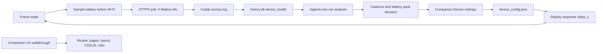

# Architecture Patterns

**Domain:** Battery-powered e-ink frame and local companion web application
**Researched:** 2026-09-30
**Confidence:** HIGH for current integration points; MEDIUM for the final field-data decision.

## Recommended Architecture

V1.1 should be an operational experiment and configuration decision, not a new device subsystem. The frame already sends `X-Battery-Mv` on every poll; Caddy-log ingestion persists it into `history.db.device_health`; `hardware/logtools.py` normalizes and evaluates that record. The companion already saves a per-device wake interval, which the server returns as `sleep_s` on the next poll. Use those seams for a second discharge run, then turn its measured result into a reversible configuration decision.

The device remains poll-only. A setting change is not pushed: the companion writes `device_config.json`, `wake.effective_wake_interval_s()` resolves it, the normal display response carries `sleep_s`, and firmware validates it before deep sleep. This keeps the existing safety and trust boundaries intact.

### Component Boundaries

| Component | Existing responsibility | V1.1 responsibility | Communicates with |
|---|---|---|---|
| `firmware/main/battery.c`, `api_client.c` | Sample before Wi-Fi and attach `X-Battery-Mv`. | Preserve comparable telemetry; no new protocol by default. | Device API. |
| `app_main.c`, `state_machine.c`, `sleep_decision.c` | Poll once, validate server `sleep_s`, deep-sleep; use distinct failure backoff. | No change unless evidence exposes an instrumentation defect. | Device API, NVS. |
| Device API and Caddy | Receive authenticated polls and record headers. | Remain the sole raw field-observation channel. | Firmware, access log. |
| `server/history_db.py`, `poll_cycle.py` | Ingest durable `device_health` rows. | Supply the experiment input; extend only for a demonstrated missing datum. | SQLite, companion. |
| `hardware/logtools.py`, `hardware/BATTERY-RUN.md` | Normalize exports and calculate run gates/projections. | Define and compare the second cadence run; fit and record the wake/leakage model. | Read-only DB export, evidence files. |
| `device_config.py`, `wake.py` | Persist and resolve `wake_interval_s`, with safety precedence. | Apply the chosen cadence without a schema change. | Companion writes; poll and companion reads. |
| `config_page.py` / wake settings | Render and atomically validate the Device wake field. | Present the selected value and only the explanatory UX found necessary. | `device_config`, page context. |
| `companion/` routes, pages, layout, static assets, i18n | Render seven authenticated tabs through Phase 40 seams. | Receive narrow, walkthrough-backed polish changes. | HTTP handler, shared state, browser. |

## Data Flow

### Battery experiment and decision

1. Set an explicit alternative `wake_interval_s` through the existing companion Device settings and record its effective value before the run.
2. On each wake, the frame samples battery voltage before radio activity and sends it with boot metadata on its HTTPS poll.
3. Caddy records the headers; the existing server cycle tails that durable log and writes idempotent `device_health` rows.
4. Export the bounded window read-only, normalize it with `hardware/logtools.py`, and run pre-registered continuity, voltage-drop and depletion gates.
5. Fit the two-cadence model using observed elapsed cycles: `daily consumption = wake cost × wakes/day + sleep leakage/day`. Do not use nominal sleep alone: the first 300-second run observed a roughly 328-second mean cycle because wake work takes time.
6. Choose one cadence and retain or replace the 3000 mAh pack against a stated autonomy/freshness target and uncertainty range.
7. Save the decision through the existing field. The next healthy poll receives the resulting `sleep_s`; firmware validates it and deep-sleeps normally.

### Companion polish

1. Run a task-oriented walkthrough across all tabs and required phone/desktop breakpoints.
2. Turn observations into a ranked list before editing; assign each item to its owning layer.
3. Change routes in `routes.py`, shared navigation/shell in `layout.py`, page semantics in `pages/*`, shared reads in `page_context.py`, visuals in `static/style.css`, behavior in its named script, and copy in `i18n.py`.
4. Preserve the existing freshness-token and partial-refresh contracts; test the narrowest affected layer and browser behavior.

## Existing Contracts to Preserve

### Wake cadence precedence

`server/wake.py` resolves cadence in this order: battery-critical parked cadence, display-off cadence, stored `wake_interval_s`, then `SKYPANE_SLEEP_S`. The production decision belongs in the existing stored field. It must not bypass safety overrides or create a firmware-only or environment-only parallel setting. The companion’s normal configured range is 60–3600 seconds; the 30-second environment fallback is a development default, not a field cadence.

### Measurement comparability

The first run measured 12.34 days at configured 300 seconds, using 3,252 observed hash-skip polls and estimating 0.923 mAh per observed cycle. It did not download or refresh the panel, and it cannot separate wake energy from deep-sleep leakage. The second run should keep the same pack and comparable hash-skip workload, use a materially different cadence, retain raw rows and commands, and state any workload deviation. A pack change belongs after this comparison, followed by its own acceptance run if chosen.

### Companion module boundaries

Phase 40’s explicit route table and page modules are the seam for polish. Do not re-centralize presentation in `companion/app.py` or duplicate state reads across renderers. `page_context.build_page_context()` supplies shared state; `freshness.js` owns conditional refresh behavior.

## Changed and New Components

| Area | Change type | Recommended work |
|---|---|---|
| Battery protocol and evidence | New operational artifact | Add a second-run protocol and final analysis beside `hardware/BATTERY-RUN.md`, with cadence, window, pack, firmware/server state and raw export command. |
| `hardware/logtools.py` | Conditional extension | Add a pure, fixture-tested two-run model/report command only if current output cannot make the split reproducible. Keep parsing/gates separate from inference. |
| `history_db.py` | Usually unchanged | Current durable rows suffice. Add storage only for a proven missing observation; a migration adds operational risk. |
| Firmware/device API | Unchanged by default | Current headers and `sleep_s` are sufficient. Change only to fix measured instrumentation. |
| `device_config.py`, `wake.py`, Device settings | Configuration | Save/document the selected `wake_interval_s`; keep precedence and staleness behavior. |
| `hardware/BOM.md` | Conditional documentation/procurement | Update only after pack selection; record connector, polarity, protection, fit, charge duration and budget. |
| Companion modules | Targeted product change | Implement walkthrough findings through Phase 40 seams, including i18n and responsive/browser validation. |

## Build Order

1. **Baseline and protocol:** Freeze firmware/server versions, pack, panel workload and validity gates. Confirm `device_health` ingestion and companion cadence control before disconnecting USB.
2. **Second discharge run:** Use a significantly different stored cadence while retaining comparable workload. Preserve raw evidence and analyze it alongside the first run.
3. **Model and decision:** Publish the cadence/pack recommendation with uncertainty, apply the configuration or BOM change, and verify `sleep_s` reaches the frame.
4. **Companion walkthrough and polish:** Discovery can run while measurement accumulates; battery-facing UI changes should follow the decision so they do not present provisional values.
5. **Field validation:** Confirm the cadence on glass, observe normal check-ins, verify battery-critical/display-off precedence, and record the operating decision.

The measurement precedes the production choice because the wake/leakage split determines the cost of shorter cadence. Companion discovery is independent, but its Device/Health copy depends on the final decision.

## Anti-Patterns to Avoid

### Parallel telemetry

Do not add a companion-only counter, browser polling loop or ad-hoc log to observe discharge. It would introduce competing clocks and retention rules. Reuse `device_health`; improve `logtools.py` only where reproducibility requires it.

### Conflating cadence and pack changes

Do not change pack chemistry/capacity during the two-cadence experiment. That changes usable capacity and voltage behavior together with cadence. Make the pack choice afterward.

### Bypassing configuration precedence

Do not hard-code a cadence in firmware or set only `SKYPANE_SLEEP_S`. That makes the companion misleading and can sidestep battery-critical/display-off safeguards.

### Cosmetic companion rewrites

Do not replace the shared shell or stylesheet wholesale for “polish.” Work from observed friction and keep each fix in its owning module, preserving accessibility, responsive and refresh behavior.

## Scalability Considerations

| Concern | Current single frame | Future small fleet |
|---|---|---|
| Telemetry | Append-only, idempotent `device_health` rows are sufficient. | Keep raw exports and model output distinct; add device identity to analysis before aggregating. |
| Cadence | One companion-controlled stored setting. | Per-device settings already map naturally to per-device field decisions. |
| Companion refresh | Browser refresh derives next-wake/staleness from server state. | Keep it independent from frame wake cadence; do not infer device activity from browser activity. |

## Sources

- `hardware/BATTERY-RUN.md` — first-run protocol, result, limitations and observation channel. HIGH confidence.
- `.planning/seeds/SEED-007-second-discharge-run-separate-wake-vs-leakage-energy.md`, `SEED-008-choose-real-field-wake-interval.md` and `SEED-010-companion-interface-polish.md` — V1.1 scope. HIGH confidence.
- `firmware/main/app_main.c`, `api_client.c`, `battery.c`, `sleep_decision.c` — sampling, telemetry and `sleep_s` consumption. HIGH confidence.
- `server/history_db.py`, `poll_cycle.py`, `device_config.py`, `wake.py` — persistence and cadence resolution. HIGH confidence.
- `companion/routes.py`, `page_context.py`, `pages/config_page.py`, `pages/health_page.py` and Phase 40 artifacts — companion boundaries. HIGH confidence.
