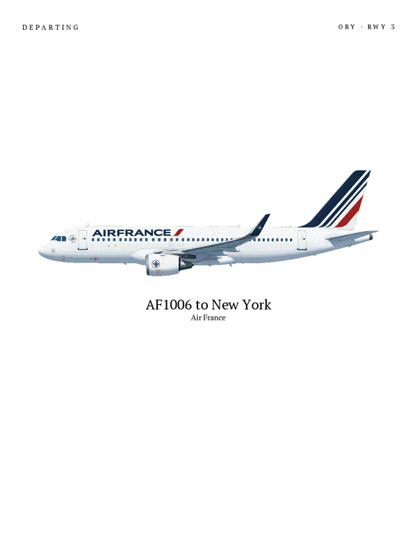

# SkyPane

**An e-ink wall frame that shows the aircraft taking off from, or landing
on, Paris-Orly's runway 3 — right now.**

<p align="center">
  
  <br>
  <sub>A server-rendered panel (sample data; on-screen colours are nominal,
  not a colour-accurate view of the physical six-colour glass).</sub>
</p>

SkyPane is a personal hobby project. A small cloud server watches free,
public ADS-B data for the aircraft using Orly's runway 3, works out who it
is and where it's going, and renders a 1200×1600 image for a 13.3" E Ink
Spectra 6 panel. A battery-powered ESP32-S3 behind the glass wakes up,
downloads the new image if it changed, redraws, and goes back to deep
sleep.

## Status

Working and running on real hardware, one frame on one wall. It's not a
product and not packaged for anyone else to deploy — but the code, the
hardware notes and the design decisions are all here if you want to build
something similar.

What v1 does **not** do yet: the RER (Orly-Ville) next-departures view, a
"leave by" cue, and the physical button that would switch between views.
These were the original idea and are planned for v2 (see
`.planning/REQUIREMENTS.md`).

## How it works

```
 ADS-B aggregators ──┐
 (adsb.fi, adsb.lol) │    ┌──────────────── VPS ─────────────────┐
                     ├──▶ │ poll loop (every 30 s)               │
 route lookup ───────┘    │   detect → enrich → render panel     │
 (adsbdb.com)             │ device server  (HTTPS, via Caddy)    │ ◀── frame wakes,
                          │ companion web app (password-gated)   │     polls, sleeps
                          └──────────────────────────────────────┘
```

- **Detect** — find the aircraft on or near runway 3 and whether it's
  departing or arriving; two independent aggregators corroborate each
  other.
- **Enrich** — callsign → airline, aircraft type and route.
- **Render** — draw directly onto the panel's six-colour palette with
  Pillow; airline-specific aircraft illustrations are dithered in.
- **Device** — ESP-IDF firmware on a wake → poll → display → deep-sleep
  cycle. The image is SHA-256 hashed, so the panel only redraws when
  something actually changed.

`ARCHITECTURE.md` has the full picture.

## Repository layout

| Directory | What it is |
|---|---|
| `server/` | The render pipeline: ADS-B detection, route enrichment, panel rendering, the poll loop and the device-protocol server. See `server/README.md`. |
| `firmware/` | ESP32-S3 firmware (ESP-IDF, C). Derived from [FlightPortrait](https://github.com/flightportrait/frame) — see `firmware/VENDOR.md`. |
| `companion/` | A small password-protected web app (stdlib only, English or French UI) to see what the frame is showing, change its look, and check its health. |
| `deploy/` | Provisioning scripts, systemd units and the runbook for the always-on VPS. See `deploy/README.md`. |
| `stub-server/` | A minimal local server that speaks the device protocol, for firmware bring-up without a deployed backend. |
| `hardware/` | Bill of materials, bring-up log, battery-life measurements. |
| `adsb-test/` | The early spike that proved public ADS-B feeds can see low-altitude traffic near runway 3. |
| `.planning/` | Planning history: requirements, roadmap, per-phase plans and summaries. Kept as a record of how the project was built. |

## Hardware

A Seeed **XIAO ePaper DIY Kit EE02** (XIAO ESP32-S3 Plus + 13.3" E Ink
Spectra 6 panel, 1200×1600, six colours) and a 3.7 V LiPo pack — about
€210 including VAT and shipping. `hardware/BOM.md` has the full list,
including a warning about battery connector polarity (reversed polarity
destroys the board).

One bring-up gotcha worth knowing before you flash anything: after each
wake cycle the board disappears from the USB device list within seconds.
That looks exactly like a boot loop, but it's deep sleep powering the USB
peripheral off. `hardware/BRINGUP-LOG.md` explains how to tell the two
apart.

## Running it locally

Requires Python 3.14.

```bash
python3 -m venv server/.venv
server/.venv/bin/pip install --require-hashes -r server/requirements.txt
```

To run the tests too, install the dev superset instead (adds pytest and
friends on top of the runtime pins above):

```bash
server/.venv/bin/pip install --require-hashes -r server/requirements-dev.txt
```

Render a panel by hand (writes the 960,000-byte panel file plus a PNG
preview):

```bash
server/.venv/bin/python3 server/plane/render.py --state departing --callsign AF1380 --out /tmp/panel.bin --preview /tmp/panel.png
```

Run one real poll cycle against the live ADS-B feeds:

```bash
server/.venv/bin/python3 server/poll_loop.py --once --state-dir /tmp/skypane-state
```

## Tests

```bash
./scripts/run-all-tests.sh
```

This is exactly what CI runs: a thin wrapper over `pytest -n auto --cov`.
pytest and pytest-xdist own discovery and parallelism (`JOBS=1` for
serial), pytest-cov enforces the coverage gate, and extra arguments are
passed straight through to pytest (e.g. `./scripts/run-all-tests.sh -k
dither`). Firmware logic that doesn't need hardware has host tests:
`firmware/tests/run_host_tests.sh`.

The companion's browser tests use pytest-playwright and need the
Chromium headless shell:
`server/.venv/bin/python3 -m playwright install --only-shell chromium`.
Locally, a missing browser shows up as a pytest skip with a reason; in CI,
or with `SKYPANE_REQUIRE_BROWSER=1`, it fails the run. Run only the
browser tests with `./scripts/run-all-tests.sh -m browser`.

## Firmware

The firmware builds in a pinned ESP-IDF container, so no toolchain
install is needed:

```bash
cp firmware/main/secrets.example.h firmware/main/secrets.h
```

Edit `secrets.h` with your Wi-Fi credentials and server URL (it's
gitignored), then build:

```bash
firmware/build.sh
```

Flashing is a separate, host-native step (`firmware/flash.sh`) because
Docker's USB passthrough is unreliable on macOS.

## Deployment

In production, the poll loop, the device server and the companion app run
as separate systemd services on a small VPS, behind Caddy for TLS. CI
deploys on every push to `main`, after a manual approval. The runbook is
in `deploy/README.md`.

## Data sources

This project uses real-time ADS-B aircraft position data from
[adsb.fi](https://adsb.fi), queried first of two default aggregator
sources by every automated poll as of 2026-08-27. It is joined by
[adsb.lol](https://adsb.lol) as the second default source — two
independent feeds can corroborate or contradict a single reading, which
one feed alone cannot; adsb.lol's data is CC0-licensed and credited here
by choice, not because its licence requires it. Callsign/airline/route
enrichment is provided by [adsbdb.com](https://www.adsbdb.com), a free,
unauthenticated, crowdsourced lookup service.

No raw aggregator data is republished: the device downloads a rendered
image of one selected flight, not a feed or a dataset. `COMPLIANCE.md`
has the terms analysis for every source, including
[airplanes.live](https://airplanes.live), which is still available as an
opt-in `--provider` but no longer called by default.

Thanks to the volunteers who feed and run these services.

## Licence

SkyPane's own code and documentation are released under the
[GNU Affero General Public License v3.0](./LICENSE) (AGPL-3.0-only).
Some parts have other licences:

| Path | Licence |
|---|---|
| `firmware/`, `stub-server/byos_server.py` | Apache-2.0 — derived from FlightPortrait © 2026 YODE PTE LTD ([`firmware/LICENSE`](./firmware/LICENSE), [`firmware/NOTICE`](./firmware/NOTICE)) |
| `server/assets/fonts/` | SIL Open Font License 1.1 (Inter, Zilla Slab, PT Serif) |
| `server/assets/icons/plane-*` | ISC (derived from Lucide) |
| `server/assets/icons/illustrations/` | AI-generated images, not AGPL-licensed — see below |

[`NOTICE`](./NOTICE) has the full map. Each vendored directory has a
`VENDOR.md` with per-file provenance.

In short, the AGPL means you're free to use, study, modify and share
SkyPane, including running it as a service, as long as you publish your
changes under the same licence, including the code of a modified server
that other people use over a network.

### Commercial licence

If you'd like to use SkyPane in a product or service without the AGPL's
obligations, for example without publishing your own changes, a
commercial licence is available. Get in touch by
[opening an issue](https://github.com/florianlepont/skypane/issues/new)
titled "Commercial licence", or via
[github.com/florianlepont](https://github.com/florianlepont).

Everything published before 2026-09-23 was released under the MIT
License (the last MIT version on `main` is commit `efafc89`), and copies
obtained under those versions stay MIT.

### Trademarks

Airline names, logos and liveries, and the insignia of state and military
aircraft, shown in the illustrations belong to their respective owners.
They are used only to identify the aircraft on the runway, in a
non-commercial project. SkyPane is not affiliated with or endorsed by any
airline, airport operator, aircraft manufacturer or government body. If
you hold rights in one of these marks and want it removed, please open an
issue and it will be replaced with a generic aircraft.

## Contributing

Issues and pull requests are welcome — see
[`CONTRIBUTING.md`](./CONTRIBUTING.md), which explains the licence terms
that apply to contributions.

## Security

Please report vulnerabilities privately — see [`SECURITY.md`](./SECURITY.md).

## How this was built

SkyPane is developed with heavy use of AI coding assistants (mostly
Claude Code), which is why many commits carry a `Co-Authored-By` trailer
and why `.planning/` and `.claude/` exist. Every change is reviewed and
verified before it lands on `main`.
